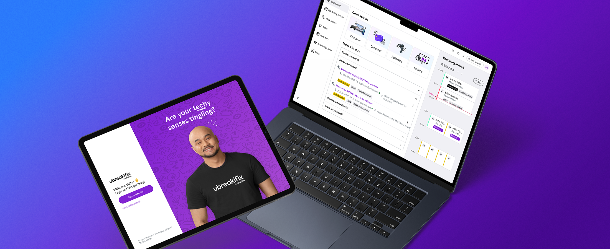

# Project Documentation

Single source of truth for structure, conventions, and patterns. **Reference this before making changes.**

---

## Project Structure

```
deazuadesign-portfolio/
├── index.html              # Homepage: Work, How I Lead, About, Testimonial, Connect
├── leadership.html         # Leadership philosophy page (linked from About)
├── assets/
│   └── images/
│       ├── logo.png
│       └── projects/
│           ├── gss/        # Disney Guest Service Suite
│           │   ├── disney-gss-hero-2200x900.png           # Hero
│           │   ├── gss-feature-card-guest-interaction.png  # Guest Interaction History
│           │   ├── gss-feature-card-magic bands.png       # MagicBands & Media
│           │   ├── gss-feature-card-dropdowns.png         # Challenge 01 (Not Responsive)
│           │   ├── gss-feature-card-data-entry.png        # Simplified Data Entry
│           ├── claims/     # In-Store Claims Kiosk
│           │   ├── claims-hero-2200x900.png
│           │   ├── claims-feature-block-compliance-1200x700.png   # Challenge 01
│           │   ├── claims-feature-block-disconnected-1200x700.png # Challenge 02
│           │   ├── claims-feature-block-repair-2-1200x700.png     # Challenge 03 (alternate)
│           │   ├── claims-feature-block-repair-1200x700.png       # Challenge 03
│           │   ├── claims-feature-block-choose-1200x700.png       # Evolution (Kiosk to Handheld)
│           │   ├── claims-feature-block-service design-1200x700.png # Process (Service design)
│           │   └── claims-feature-block-pilot-1200x700.png        # Process (Store pilot)
│           ├── nextgen/    # Next-Gen Portal
│           │   ├── next-gen-hero-2200x900.png
│           │   ├── next-gen-feature-block-1200x700.png  # Final design
│           │   ├── next-gen-feature-card-1400x440.png  # Service blueprint
│           │   └── next-gen-feature-card-legacy-1400x440.png  # Legacy system (Challenge 02)
│           ├── expert-workspace/  # Asurion Expert Workspace
│           │   └── asurion-expert-workspace.png  # Hero
│           ├── universal/  # Halloween Horror Nights (legacy)
│           ├── hhn/       # Halloween Horror Nights
│           │   ├── hhn-hero-2200x900-2.png
│           │   ├── hhn-feature-block-1400x440-2.png
│           │   ├── hhn-cohesive-brand.png
│           │   ├── hhn-tickets-new.png
│           │   └── hhn-tickets-old.png
│           └── wyndham/    # Vacation Planner
│               ├── cw-hero-2200x900-2.png
│               ├── cw-explore-resort-feature-1200x700.png  # Solution hero (Final design)
│               ├── cw-explore-resort-member.png           # Member experience
│               ├── cw-explore-resort-prospect.png         # Prospect experience
│               ├── cw-feature-card-discoverability.png    # Challenge 01
│               ├── cw-feature-card-education-gap.png      # Challenge 02
│               └── cw-feature-card-inventory.png         # Challenge 03
├── css/
│   ├── main.css            # Global styles, variables, layout
│   └── case-study.css      # Case study page styles
├── js/
│   └── main.js             # Main JavaScript
├── projects/               # Case study HTML pages
│   ├── case-study-expert-workspace.html
│   ├── case-study-nextgen-portal.html
│   ├── case-study-disney-guest-service.html
│   ├── case-study-halloween-horror-nights.html
│   ├── case-study-instore-kiosk.html
│   └── case-study-vacation-planner.html
└── docs/
    └── PROJECT_DOCS.md     # This file
```

---

## Conventions

### Hero Image + Homepage Card (Always Sync)

When adding or updating a **hero image** on a case study page:

1. **Case study page** (`projects/case-study-*.html`): Add/update the hero image inside `case-hero-content` (between `case-intro` and `case-meta`).
2. **Homepage** (`index.html`): Update the matching work card to use the same image.

Both must stay in sync. See "Hero Image Pattern" below.

### Image Paths

- **From `index.html`**: `assets/images/projects/{project}/filename.ext`
- **From `projects/*.html`**: `../assets/images/projects/{project}/filename.ext`

### iOS Safe Area Support

All pages must include `viewport-fit=cover` in the viewport meta tag so `env(safe-area-inset-*)` resolves correctly on notch devices (Dynamic Island, etc.).

### Hero Image Pattern

**Case study hero** (in `projects/case-study-*.html`):

The hero image lives **inside** `case-hero-content`, between the subtitle (`case-intro`) and the metadata (`case-meta`). The `case-hero-content` container is 1100px max-width (matching `case-content`) while text elements (`case-back`, `case-client`, `case-title`, `case-intro`, `case-meta`, `case-meta-extended`) are constrained to 900px max-width.

```html
<div class="case-hero-content">
  <!-- title, subtitle... -->
  <div class="case-image image-hero">
    
  </div>
  <div class="case-meta">...</div>
</div>
```

**Homepage card** (in `index.html`):

```html
<div class="card-image has-image" style="background: linear-gradient(...);">
  
</div>
```

- Use simple ``—no extra attributes.
- `case-image image-hero` for case study; `card-image has-image` for homepage cards.

### Case Study Page Structure

1. Password overlay (if protected)
2. Nav
3. Case hero (title, intro, **hero image**, case-meta, case-meta-extended)
4. Sections (Challenge, Design Principles, Approach, Solution, Leadership Challenge, etc.)
5. Next project CTA
6. Footer

### Case Study Hero Metadata Pattern

The hero contains two metadata rows, both inside `case-hero-content`:

- **`case-meta`** — Horizontal flex row with short values (Role, Timeline, Team, Platform). Uses `meta-label` (0.75rem, uppercase, muted) + `meta-value` (600 weight, Space Grotesk, white).
- **`case-meta-extended`** — 2-column grid below `case-meta` for longer-form values (My Focus, Key Challenge). Uses the same `meta-label` / `meta-value` classes with a separating top border. Collapses to 1 column at 768px.

```html
<div class="case-meta-extended">
  <div class="meta-item">
    <p class="meta-label">My Focus</p>
    <p class="meta-value">...</p>
  </div>
  <div class="meta-item">
    <p class="meta-label">Key Challenge</p>
    <p class="meta-value">...</p>
  </div>
</div>
```

### Homepage How I Lead Section

Condensed version of the leadership page, inserted between Work and About. Layout: centered—heading "How I Lead" with intro paragraph ("I build teams…") centered below it, then 4 highlight cards (Building Teams, Ownership & Clarity, Growth & Innovation, Driving Impact) in a 2x2 grid with the same spacing as case study cards (`gap: var(--space-lg)`). Below the cards: one testimonial quote and a link to the full leadership page. Uses `highlight-card` from case-study.css. Classes: `how-i-lead-section`, `how-i-lead-intro-text`, `how-i-lead-cards`, `how-i-lead-footer`.

### Homepage About Section

Content on the left, image on the right (mirrors How I Lead layout). Uses `about-grid` with `about-text` and `about-image-placeholder`. The placeholder shows "Photo coming soon" until a real image is added. To add a photo: replace the placeholder content with `` — the container styles support `object-fit: cover`.

### Leadership Page

Standalone page at `leadership.html` (root level). Linked from the About section and How I Lead section on the homepage. Uses same design system as case studies: `case-hero`, `case-section`, `highlight-grid`, `highlight-card`, `testimonial`, `next-project`. Four themed sections: Building Teams, Ownership & Clarity, Growth & Innovation, Driving Impact. Each section includes a testimonial quote from check-ins.

### Typographic Quotes (Semantic + Accessible)

Use semantic HTML for all quotations. Never use raw straight `"` for visible quotation marks.

- **Block-level quotes** (testimonials, case-quote callouts): Use `<blockquote>` with class `testimonial` or `case-quote`. CSS adds curly open/close quotes via `::before`/`::after` pseudo-elements.
- **Inline quotations** (persona voices in highlight cards, quoted phrases in body text): Use `<q>`. Browsers generate proper curly quotes via the CSS `quotes` property.
- Quote characters: Open `\201C` ("), close `\201D` ("). Defined in `main.css` (base `q` rule) and `case-study.css` (`.case-quote p`, `.highlight-text q`).

---

## CSS Classes Reference

| Class | Location | Purpose |
|-------|----------|---------|
| `hero-floating-icons` | main.css | Decorative icon layer in homepage hero |
| `hero-float-icon` | main.css | Individual floating icon (position, size, parallax) |
| `hero-float-icon--accent` | main.css | Accent icon (primary-light color; same 64px size) |
| `case-quote` | case-study.css | Block quote callout (use with `<blockquote>`) |
| `case-image image-hero` | case-study.css | Hero image container (450px height) |
| `case-meta-extended` | case-study.css | 2-column grid for My Focus + Key Challenge in hero (collapses to 1-col at 768px) |
| `password-contact` | case-study.css | Muted mailto text link in password modal ("Need the password? Contact me") |
| `card-image has-image` | main.css | Homepage card with image |
| `about-leadership-link` | main.css | About/How I Lead link to leadership.html |
| `leadership-cta-links` | main.css | Dual CTA container on leadership page |
| `how-i-lead-section` | main.css | Homepage condensed How I Lead section (centered layout) |
| `how-i-lead-cards` | main.css | 2x2 grid of highlight cards (same gap as case study cards) |
| `about-image-placeholder` | main.css | About section photo placeholder (replace content with img when ready) |
| `feature-image has-image` | case-study.css | Feature block with image |
| `image-placeholder` | case-study.css | Placeholder when no image yet |

---

## Password-Protected Case Studies

| Case Study | Page | Password |
|------------|------|----------|
| Expert Workspace | `case-study-expert-workspace.html` | `velvet` |
| Next-Gen Portal | `case-study-nextgen-portal.html` | `velvet` |
| Disney Guest Service Suite | `case-study-disney-guest-service.html` | `velvet` |

Passwords are stored in sessionStorage—users enter once per browser session. Each page has a unique `STORAGE_KEY` so sessions are independent.

**Feature flag:** Password protection is controlled by `FEATURE_FLAGS.caseStudyPasswordProtection` in `js/main.js`. When `false`, the overlay is hidden and case studies are viewable without a password. Set to `true` when applying to re-enable.

**Contact link:** Each modal includes a "Need the password? Contact me" mailto link after the "Back to Work" button: `mailto:ricardo@deazuadesign.com?subject=Please%20send%20me%20your%20case%20study%20password.` Styled with `.password-contact` class in `case-study.css`.

**Password visibility toggle:** An eye icon (Iconoir `iconoir-eye` / `iconoir-eye-closed`) lets users show or hide the password. Implemented in `main.js` via `initPasswordToggle()`. Follows WCAG: `aria-pressed`, `aria-controls`, constant `aria-label="Show password"`, optional live region. Input is restored to `type="password"` before form submit to avoid autocomplete saving plain text.

**Z-index:** Custom cursor uses `z-index: 10002` so it remains visible above the password overlay (`z-index: 10001`). Password input uses `caret-color: var(--primary)` for visible text caret.

---

## Iconoir Icons

Icons are provided by [Iconoir](https://iconoir.com/) (1500+ SVG icons, MIT license). Loaded via `@import` in `main.css` from the CDN.

**Usage:** Wrap the icon in the appropriate container class:

```html
<span class="expertise-icon"><i class="iconoir-design-nib"></i></span>
<div class="highlight-icon"><i class="iconoir-spark"></i></div>
<div class="feature-image-icon"><i class="iconoir-search"></i></div>
<span class="link-icon"><i class="iconoir-linkedin"></i></span>
```

- Browse icons: [iconoir.com](https://iconoir.com/)
- Icons inherit font size and `color` (styled via CSS mask)
- Container classes: `expertise-icon`, `highlight-icon`, `feature-image-icon`, `link-icon`
- `highlight-icon` (larger cards): 48px, color `#A0A0B8`, stroke-width 1

**Icon mapping:** Emojis have been replaced with Iconoir icons across the site. Placeholder cards (Halloween Horror Nights when no hero image) and their image-placeholder sections keep emojis. Key mappings: `design-nib` (Brand), `color-filter` (Product), `community` (Culture), `spark` (Craft), `chat-bubble`, `shield-check`, `archery`, `link`, `leaf`, `flash`, `graph-up`, `search`, `user`, `umbrella`, `plus`, `light-bulb-on`, `wristwatch`, `edit-pencil`, `clipboard-check`, `candlestick-chart`, `smartphone-device`, `component`, `precision-tool`, `ease-curve-control-points`, `keyframes`, `eye`, `page`, `book-stack`, `linkedin`, `dribbble`, `mail`.

### Impact Section Icons

Impact cards (`.impact-section .impact-card .impact-value`) use Iconoir icons with the same accent gradient as numeric values. Prefer `-solid` variants for KPI/impact semantics.

- **Gradient:** Icons inside `.impact-value` automatically get `linear-gradient(135deg, var(--accent) 0%, var(--primary) 100%)` via CSS override on the Iconoir `::before` pseudo-element.
- **Fallback:** When no solid variant exists, use `.impact-icon--svg` with `mask-image` set via inline style to show a custom SVG with the gradient.
- **HHN example:** Broke attendance records → `iconoir-medal-1st-solid`; Increased mobile traffic & sales → `iconoir-stats-up-square-solid`.

### Hero Floating Icons (Homepage Only)

Decorative inline SVG icons float around the hero headline "Crafting Experiences That Matter" on the homepage. Implemented in `index.html`, `main.css`, and `main.js` via `initHeroFloatingIcons()`.

**Icons:** Custom thin-stroke SVGs (exported from Iconoir at `stroke-width: 0.8`). Source files in `assets/images/hero-icons/`: `peace-hand.svg`, `keyframes.svg`, `ease-curve-control-points.svg`, `substract.svg`, `box3d-center.svg`. Inlined in HTML for `currentColor` inheritance.

**Structure:** `.hero-floating-icons` (sibling of `.hero-content`, `aria-hidden="true"`) contains exactly 5 `.hero-float-icon` spans. Each icon has an inner `.hero-float-icon-inner` with an inline `<svg>`; the outer span handles cursor parallax.

**Size convention:** All icons 64px (uniform). Colors: `var(--text-secondary)` for base, `var(--primary-light)` for accent (`.hero-float-icon--accent`).

**Opacity behavior:** Icons start at 25% on page load and ramp to 45% as the user scrolls. Formula: `opacity = 0.25 + min(1, scrollProgress / 0.33) * 0.20`, where `scrollProgress = max(0, -heroTop / heroHeight)`.

**Motion style (Refined):** Float (vertical drift + micro-rotate -4deg to +4deg) + subtle horizontal cursor parallax (±6px max, lerp-smoothed). No scale pulse.

**Reduced motion:** When `prefers-reduced-motion: reduce`, `.hero-floating-icons` is hidden via CSS and `initHeroFloatingIcons()` exits early—no float, scroll opacity, or cursor parallax.

**Pointer behavior:** Cursor parallax runs only on `(hover: hover) and (pointer: fine)`. On touch devices, only the passive float animation runs.

---

## Feature Flags

| Flag | Location | Purpose |
|------|----------|---------|
| `caseStudyPasswordProtection` | `js/main.js` → `FEATURE_FLAGS` | When `false`, password modals are hidden and case studies are viewable without a password. Set to `true` when applying to re-enable protection. |

---

## Local Development

```bash
python3 -m http.server 8000
# Open http://localhost:8000
```

---

## Updating This Doc

When you add a convention, pattern, or structural change, update this file so the next change can reference it instead of rebuilding.
